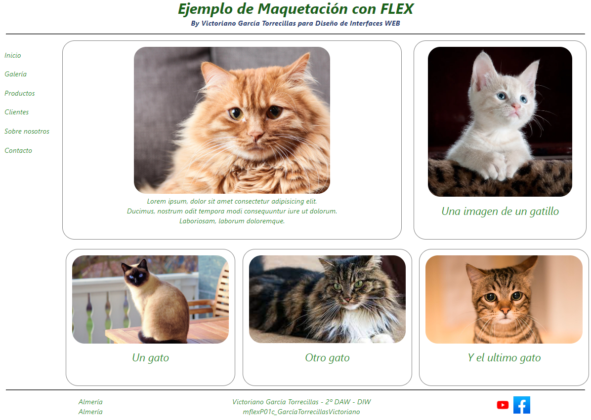
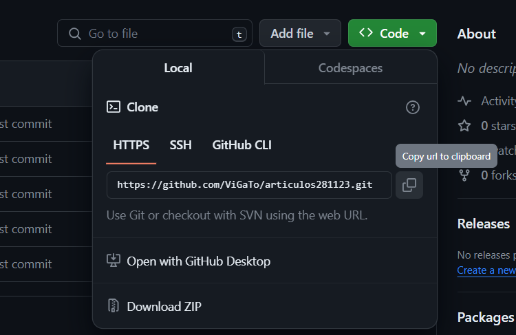

# **Maquetacion con FLEX | DIWEB**



### 📋 Descripción del proyecto 📋

El proyecto consiste en el diseño de una página web con diversos elementos y múltiples imágenes usando **FLEX** para la maquetación de la página.

### 📁 Contenido de la publicación 📁

Este repositorio contiene un README como un directorio del proyecto, el cual contiene un archivo .html, un archivo .css y una carpeta de imágenes.

### ⚙️ Desarrollo del proyecto ⚙️

Este proyecto se ha desarrollado en **Visual Studio Code**, se ha hecho uso de lenguaje **_HTML_** y **_CSS_**.

### 📦 Despliegue (link a la página principal) 📦

1. Para hacer uso de este repositorio deberemos clicar encima del cuadro verde donde dice **<> Code**.

2. Copia la dirección URL del repositorio.

- Para clonar el repositorio con HTTPS, en "HTTPS", copia el enlace [https://github.com/ViGaTo/mflexP01c_GarciaTorrecillasVictoriano.git](https://github.com/ViGaTo/mflexP01c_GarciaTorrecillasVictoriano.git) o dale a la imagen donde salen dos cuadrados.



3. Abra Git Bash.

4. Cambia el directorio de trabajo actual a la ubicación en donde quieres clonar el directorio.

5. Escriba git clone y pegue la dirección URL que ha copiado antes.

```
git clone https://github.com/ViGaTo/mflexP01c_GarciaTorrecillasVictoriano.git
```
6. Con ese comando ya pegado en Git Bash, le damos a Enter y deberia clonarse correctamente.

### 🛠️ Construido con 🛠️
- 
- 

### 💡 Versionado 💡

Esta es la primera y última versión del proyecto.

### ✒️ Autores ✒️

- [ViGaTo](https://github.com/ViGaTo)

### 📄 Licencia 📄

Este proyecto está bajo licencia gratuita.

### 🌐 Recursos adicionales 🌐

- Página principal: [https://github.com/ViGaTo](https://github.com/ViGaTo)
- Repositorio de la maquetación hecha con **GRID**: [https://github.com/ViGaTo/mGridP01_GarciaTorrecillasVictoriano.git](mGridP01_GarcíaTorrecillasVictoriano)